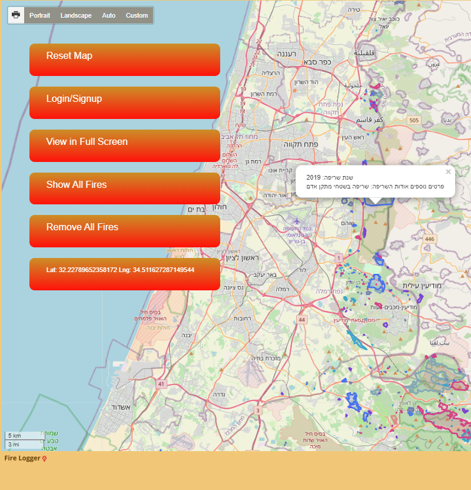
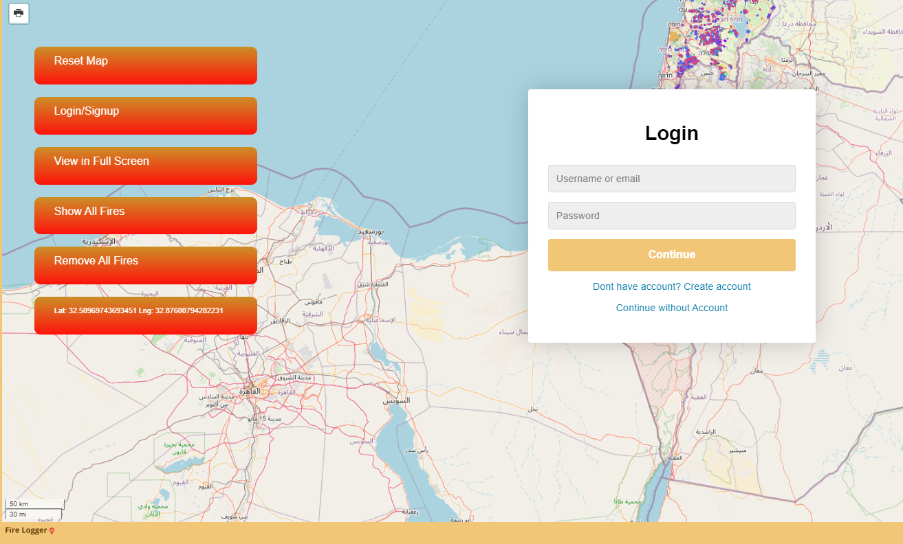
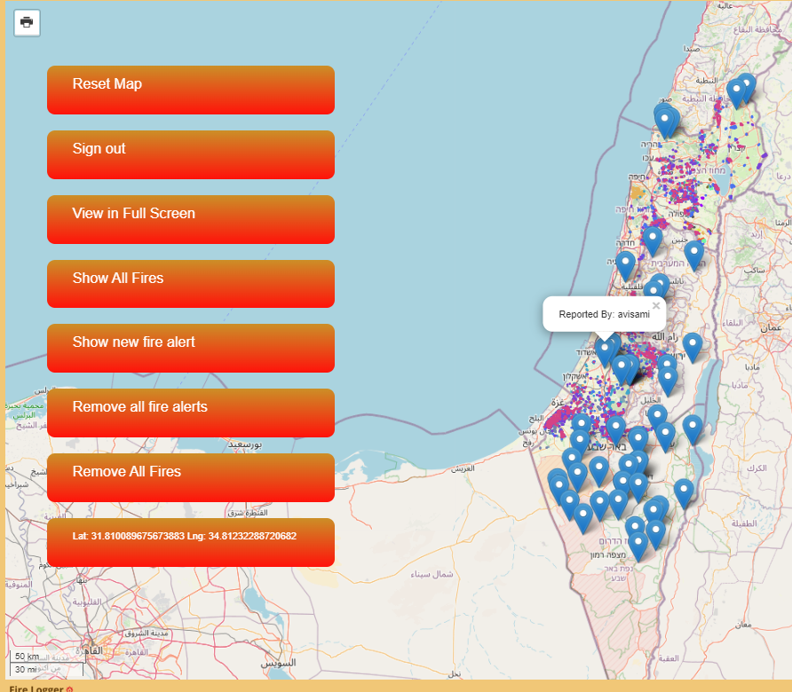

# fireLogger

Development of an application using HTML CSS JS and Leaflet that let you report on a new fire on the map.
You can also watch all the fires occurred in the last years.
The app is user based visualized by local storage that designed to illustrate user actions.
You can log in as admin by username: adminio and password: admin.
You can also login as a user by username: avisami and password: 12345.
Or by creating a user yourself.

The purpose of the app is to give access to all the people who are on the net, 
provide information about fires and draw conclusions from it. Give them an option 
to upload reports that will be availble for firefighters(the admins) for a quick response.
In this way firefighters also have the information flowing from the people 
and the people also have the information available from firefighters.

in the app:
1. You can view/remove the fires of the last years and addisonal information about the fires.
2. You can login/create user.
3. A user can add/remove fire alart.
4. Admin can see all the fire alarts from all the users/remove them.
5. You can  print/measure/zoom in and out of the map. 

## Screenshots:
- No user view:

- Login:

- Admin view:

